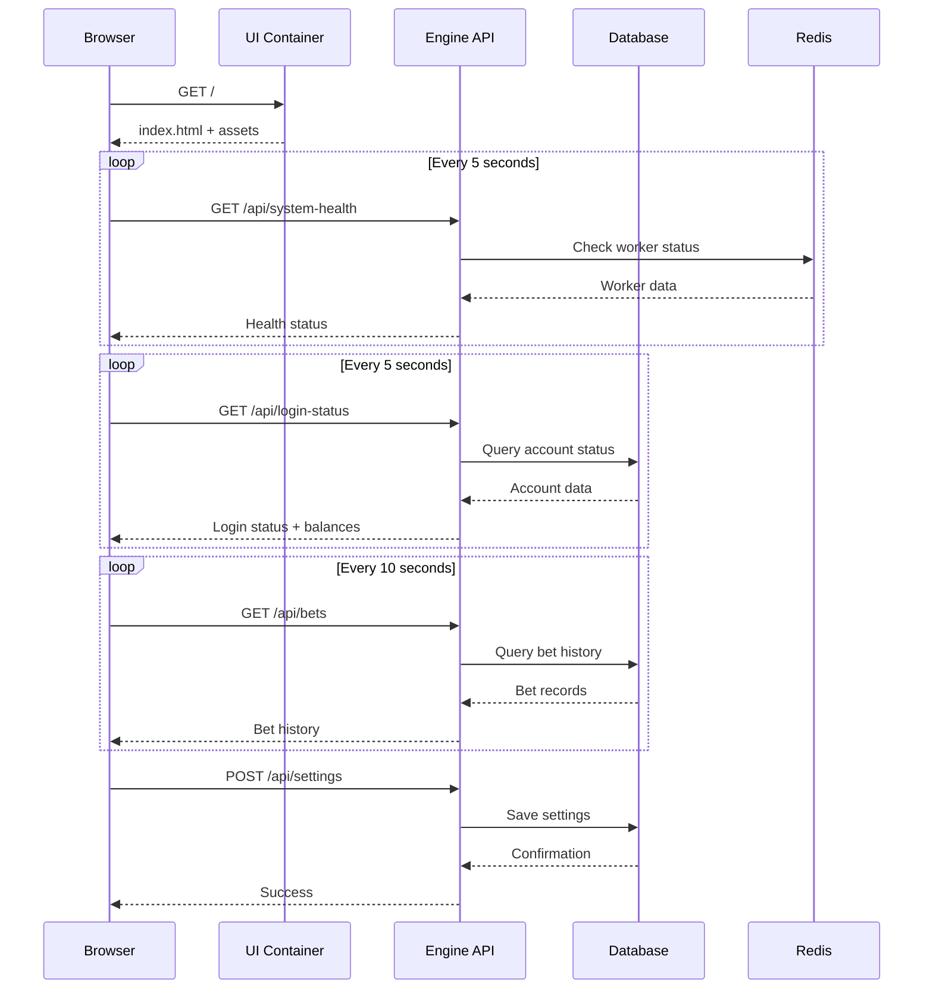
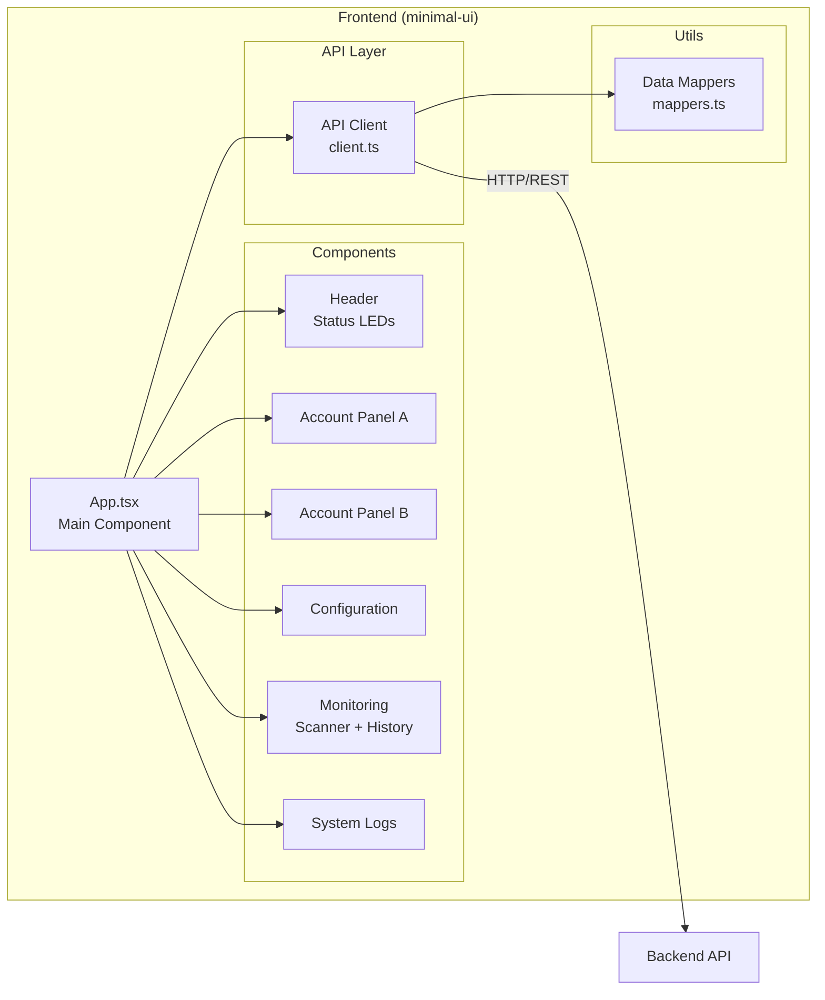
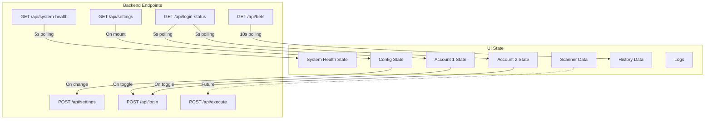

# ArbBot Pro Dashboard - Integration Architecture

## System Architecture Diagram

```mermaid
graph TB
    subgraph Browser["🌐 Browser (http://217.216.35.6:8080)"]
        UI[ArbBot Pro Dashboard<br/>React + TypeScript]
    end
    
    subgraph Docker["🐳 Docker Network (arb-network)"]
        subgraph UIContainer["arb-ui Container"]
            NGINX[Nginx Alpine<br/>Port 80]
            STATIC[/usr/share/nginx/html/<br/>Static Files]
        end
        
        subgraph EngineContainer["arb-engine Container"]
            API[Node.js Backend<br/>Port 3000]
            WS[WebSocket<br/>Port 3001]
        end
        
        subgraph RedisContainer["arb-redis Container"]
            REDIS[(Redis Cache<br/>Port 6379)]
        end
        
        subgraph PostgresContainer["arb-postgres Container"]
            DB[(PostgreSQL DB<br/>Port 5432)]
        end
    end
    
    UI -->|HTTP GET /| NGINX
    NGINX --> STATIC
    UI -->|API Calls<br/>http://engine:3000| API
    UI -.->|Future WebSocket| WS
    API --> REDIS
    API --> DB
```

## Data Flow Diagram



## Component Architecture



## API Integration Map



## File Structure

```
arb/
├── minimal-ui/                      # Frontend application
│   ├── src/
│   │   ├── api/
│   │   │   └── client.ts           # ⭐ NEW: API client for backend
│   │   ├── components/
│   │   │   ├── AccountPanel.tsx    # ✅ Existing (reused)
│   │   │   ├── Configuration.tsx   # ✅ Existing (reused)
│   │   │   ├── Header.tsx          # ✅ Existing (reused)
│   │   │   ├── Monitoring.tsx      # ✅ Existing (reused)
│   │   │   ├── Logs.tsx            # ✅ Existing (reused)
│   │   │   └── StatusLed.tsx       # ✅ Existing (reused)
│   │   ├── utils/
│   │   │   └── mappers.ts          # ⭐ NEW: Data mapping utilities
│   │   ├── App.tsx                 # ⭐ NEW: Main app (replaced App.jsx)
│   │   ├── App.jsx                 # ⚠️  OLD: Backed up
│   │   ├── main.jsx                # 🔧 Modified: Import App.tsx
│   │   ├── index.css               # 🔧 Modified: Added scrollbar styles
│   │   └── types.ts                # ✅ Existing (unchanged)
│   ├── .env.production             # ⭐ NEW: Production env vars
│   ├── Dockerfile                  # 🔧 Modified: Copy .env.production
│   ├── nginx.conf                  # ✅ Existing (unchanged)
│   └── package.json                # ✅ Existing (unchanged)
│
├── engine/                          # Backend (unchanged)
│   ├── src/
│   │   ├── routes/
│   │   │   └── *.routes.js         # Should implement API endpoints
│   │   └── services/
│   │       └── *.service.js        # Backend logic
│   └── Dockerfile
│
├── docker-compose.yml              # ✅ Existing (unchanged)
├── deploy-ui-update.sh             # ⭐ NEW: Deployment script
├── FRONTEND_INTEGRATION_COMPLETE.md # ⭐ NEW: Full documentation
└── DEPLOYMENT_QUICKREF.txt         # ⭐ NEW: Quick reference
```

## Environment Configuration

### Development
```env
VITE_API_URL=http://localhost:3000
VITE_API_WS_URL=ws://localhost:3000
```

**Use Case:** Local development, running frontend with `npm run dev`

### Production (Docker)
```env
VITE_API_URL=http://engine:3000
VITE_API_WS_URL=ws://engine:3000
```

**Use Case:** Docker deployment, UI container communicates with engine container via Docker network

## Network Topology

```
External Access:
    Browser → http://217.216.35.6:8080 → arb-ui (Port 8080:80)
    Browser → http://217.216.35.6:3000 → arb-engine (Port 3000:3000)

Docker Internal Network (arb-network):
    arb-ui → http://engine:3000 → arb-engine
    arb-engine → redis://redis:6379 → arb-redis
    arb-engine → postgres://postgres:5432 → arb-postgres
```

## Technology Stack Mapping

### Frontend Stack
| Layer | Technology | Purpose |
|-------|-----------|---------|
| Framework | React 18.2.0 | UI rendering |
| Language | TypeScript 5.3.3 | Type safety |
| Build Tool | Vite 5.0.8 | Fast builds |
| Styling | Tailwind CSS 3.4.0 | Utility-first CSS |
| Icons | Lucide React 0.556.0 | Icon library |
| Charts | Recharts 3.5.1 | Data visualization |
| Server | Nginx Alpine | Static file serving |

### Backend Stack (Existing)
| Layer | Technology | Purpose |
|-------|-----------|---------|
| Runtime | Node.js | Backend execution |
| Database | PostgreSQL 15 | Persistent storage |
| Cache | Redis 7 | Session & cache |
| API Style | REST | HTTP endpoints |
| Real-time | WebSocket | Live updates |

## API Polling Strategy

| Data Type | Endpoint | Interval | Reason |
|-----------|----------|----------|--------|
| System Health | GET /api/system-health | 5s | Real-time status monitoring |
| Login Status | GET /api/login-status | 5s | Account balance & ping updates |
| Bet History | GET /api/bets | 10s | Lower priority, less frequent |
| Settings | GET /api/settings | On mount only | Static data |

## State Management Flow

```
User Action
    ↓
UI Event Handler
    ↓
Update Local State (optimistic)
    ↓
API Call (via client.ts)
    ↓
Backend Processing
    ↓
Response
    ↓
Data Mapping (via mappers.ts)
    ↓
Update State (confirmed)
    ↓
Re-render Components
```

## Error Handling Strategy

```
API Request
    ├─ Success
    │   ├─ Map data (mappers.ts)
    │   ├─ Update state
    │   └─ Add SUCCESS log
    │
    └─ Failure
        ├─ Log error to console
        ├─ Add ERROR log to UI
        ├─ Keep previous state
        └─ Retry on next poll
```

## Security Considerations

1. **API Authentication**: Currently open, should implement JWT tokens
2. **CORS**: Must be configured on backend to allow http://217.216.35.6:8080
3. **Input Validation**: All user inputs should be validated on backend
4. **LocalStorage**: Used for non-sensitive UI preferences only
5. **HTTPS**: Should be implemented in production via nginx reverse proxy

## Performance Optimization

1. **Polling Intervals**: Tuned to balance real-time updates vs server load
2. **Data Caching**: LocalStorage for configuration persistence
3. **Lazy Loading**: Components loaded on demand
4. **Memoization**: React.memo and useCallback for expensive operations
5. **Code Splitting**: Vite handles automatic code splitting

## Deployment Pipeline

```
Developer Machine
    ↓ git push
GitHub Repository (guntjong-max/arb)
    ↓ git pull
Production Server (217.216.35.6)
    ↓ npm install
Node.js Build (Vite)
    ↓ npm run build
Static Files (dist/)
    ↓ Docker build
Docker Image (arb-ui)
    ↓ Docker run
Nginx Container
    ↓ HTTP serve
End Users (Browser)
```

## Monitoring & Observability

### Frontend Monitoring
- Browser console logs
- Network tab for API calls
- React DevTools for component state
- Performance metrics via Lighthouse

### Container Monitoring
```bash
docker logs arb-ui --tail 100 --follow
docker stats arb-ui
docker exec arb-ui cat /var/log/nginx/access.log
docker exec arb-ui cat /var/log/nginx/error.log
```

### API Monitoring
```bash
docker logs arb-engine --tail 100 --follow
docker stats arb-engine
```

## Future Enhancements

1. **WebSocket Integration**: Real-time arbitrage opportunities
2. **Authentication**: JWT-based user authentication
3. **Mobile Responsive**: Optimize for mobile devices
4. **Dark/Light Theme**: User-selectable themes
5. **Internationalization**: Multi-language support
6. **Error Tracking**: Integrate Sentry or similar
7. **Analytics**: User behavior tracking
8. **PWA Support**: Offline capabilities

---

**Document Version:** 1.0  
**Created:** December 9, 2025  
**Status:** ✅ Complete
